# Project64 for Apple Silicon: user guide

This is a fork of Project64 that builds and runs on macOS on Apple Silicon only. It draws
with OpenGL through an SDL3 window, takes keyboard, gamepad, mouse and webcam input, and
runs one game per window. There is no menu and no settings screen: everything is a command
in a terminal, and this guide is the list of them.

1. [Before you start](#1-before-you-start)
2. [Your ROMs](#2-your-roms)
3. [Playing a game](#3-playing-a-game)
4. [Several games at once](#4-several-games-at-once)
5. [Bindings by hand](#5-bindings-by-hand)
6. [The binding wizard](#6-the-binding-wizard)
7. [Playing with a mouse](#7-playing-with-a-mouse)
8. [Playing with your face](#8-playing-with-your-face)
9. [A layout per game](#9-a-layout-per-game)
10. [When something goes wrong](#10-when-something-goes-wrong)
11. [Reference](#11-reference)

## 1. Before you start

You need a Mac with an Apple Silicon chip, the Xcode command line tools and Homebrew.

```sh
xcode-select --install
brew install sdl3 pkg-config yaml-cpp
```

SDL3 must be 3.4 or newer; `make` checks and says so if it is not.

Build everything. A clean build takes a few minutes.

```sh
make -j8 all
make test
```

`make test` prints the version line and four `ok:` lines, one per plugin. `make help`
lists the targets you run; the build stages are hidden. The build lands in `Bin/macOS/`:
the emulator `Project64`, the binding wizard `Project64-wizard`, the four plugins under
`Plugin/`, and the data the emulator reads under `Config/` and `Lang/`. The data has to
sit beside the binary; `make all` puts it there.

## 2. Your ROMs

No game data ships with this repository and the build produces none. You supply your own
ROM files, as `.z64`, `.n64`, `.v64`, or a `.zip` holding one of them. 7-Zip archives are
not supported.

There is no ROM browser. You name the file on the command line. The convention is a
`Roms/` folder at the top of the repository, which git ignores:

```sh
mkdir -p Roms
cp ~/Downloads/super_mario_64.z64 Roms/
```

## 3. Playing a game

```sh
make run rom=Roms/super_mario_64.z64
```

or, once built, `./Bin/macOS/Project64 Roms/super_mario_64.z64`. The window opens at
640x480. Drag a corner to resize it, down to half that size, or use the green button for
full screen. The picture keeps its shape, with black bars at the sides in full screen, and
is scaled up from 640x480 rather than drawn at the larger size, so it looks softer when big.
Close the window to quit. Saves go to `Bin/macOS/Save/`.

The built-in controls, keyboard and gamepad at once:

| N64 control | Keyboard | Gamepad |
|---|---|---|
| A | X | South face button (A on an Xbox pad, Cross on a PlayStation pad) |
| B | C | West face button (X on Xbox, Square on PlayStation) |
| Z | Z | Left trigger |
| Start | Return | Start |
| L | Q | Left shoulder |
| R | E | Right shoulder |
| C-Up, C-Down, C-Left, C-Right | W, S, A, D | Right stick |
| D-pad up, down, left, right | I, K, J, L | D-pad |
| Control stick | Arrow keys | Left stick |

A gamepad is picked up when it is plugged in, before or after launch. That said, a fresh
build's shipped `Config/input.yaml` names every control with a key only, so the gamepad
column does nothing until you edit that file — section 5 shows how.

Section 5 changes the table by editing a file; section 6 builds that file for you.

One limit to know: the CPU is always the interpreter, because Apple Silicon refuses the
writable-and-executable memory a dynamic recompiler needs. Super Mario 64 still runs at
full speed with sound.

## 4. Several games at once

```sh
make grid roms="Roms/a.z64 Roms/b.z64 Roms/c.z64"
```

or `./Bin/macOS/Project64 --grid Roms/a.z64 Roms/b.z64 …`. One to sixteen games open side by side in
a near-square grid, each at the largest 4:3 size that fits its cell, all muted. A small
always-on-top strip along the bottom owns the keyboard and sends every key to every game
at once; the tiles never take focus. Escape on the strip, or closing it, quits everything.

Each game is its own process, so one crashing cannot take the others down. Per-game
layouts (section 9) are ignored in the grid, and the tiles cannot be resized.

## 5. Bindings by hand

Bindings are read once at startup from `Bin/macOS/Config/input.yaml`. `make all` copies
that file in once and never overwrites it, so your edits survive rebuilds. Delete it to get
the built-in table back.

Each control named in the file takes exactly one input. That replaces the control's
built-in binding, which is a key and a gamepad input at once; a control left out keeps
both. The shipped file names every control with a key, which is why a fresh build's
gamepad does nothing until you swap in the commented gamepad block in the same file.

```yaml
bindings:
  A:         {key: X}
  B:         {button: b}
  Z:         {axis: lefttrigger}
  CUp:       {axis: righty, sign: -}
  Stick:     {stick: left}
```

The forms: `{key: <name>}` with an SDL key name such as `X`, `Return`, `Space`, `Up`;
`{button: <name>}` with an SDL gamepad name such as `a`, `b`, `start`, `leftshoulder`,
`dpup`; `{axis: <name>}`, `{axis: <name>, sign: +}` or `{axis: <name>, sign: -}` with
`lefttrigger`, `rightx`, `righty` and so on. `Stick` also takes `{stick: left}`,
`{stick: right}` or four keys as `{keys: {up: Up, down: Down, left: Left, right: Right}}`.
Sections 7 and 8 add the forms for the mouse panel, face gestures and head pose.

A file with a mistake is ignored whole and the built-in table is used instead. The
emulator prints one line on stderr starting `input:` that names the file and the problem,
and, where it can, the line.

`PJ64_INPUT_YAML=/path/to/file.yaml` in the environment overrides the file for one run:

```sh
PJ64_INPUT_YAML=~/my.yaml ./Bin/macOS/Project64 Roms/game.z64
```

## 6. The binding wizard

```sh
make run-wizard
```

opens a small window that walks the fifteen controls and writes the file from section 5
for you, including the mouse-panel and face forms that are hard to spell by hand. It never
loads a game. The pictures below are what it draws.

**Pick a starting point.** The built-in table, one of the five shipped mouse and face
layouts, or a file whose path you type. Up and Down move, Enter chooses.

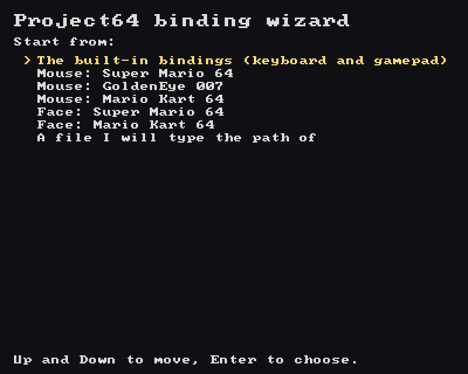

**One control at a time.** Each screen names the control, shows what it is bound to now,
and offers five ways to bind it: `1` a keyboard key, `2` a gamepad button, `3` a gamepad
axis, `4` a slot on the mouse panel, `5` a face gesture. Enter keeps what is there and
moves on, Delete returns the control to its built-in binding, Backspace goes back one
control, Escape jumps to the review. "inherited" means the file will not mention this
control, so it keeps its built-in key and gamepad pair.

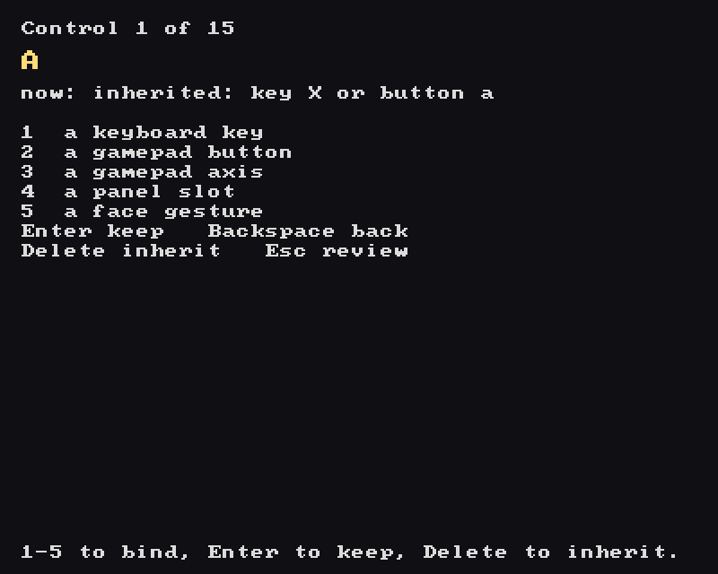

**A key.** Press `1`, then the key. The next key is the binding, Escape and the arrows
included, so there is no cancel: press `1` again to capture a different one.

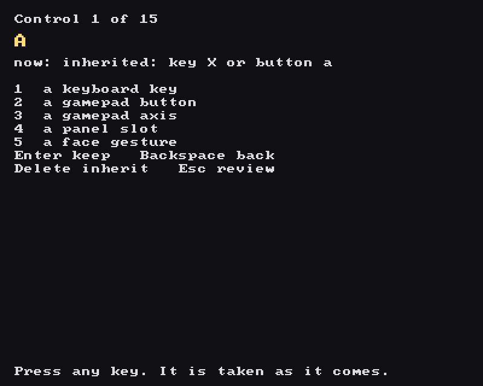

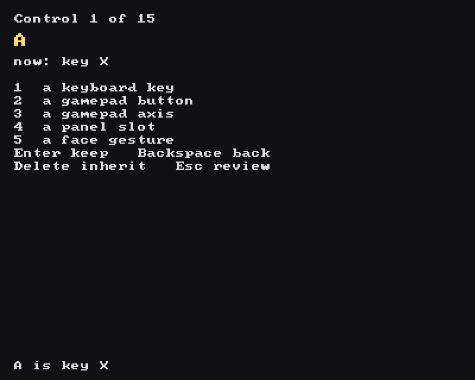

**A gamepad button or axis.** `2` and `3` need a gamepad connected and say so when there is
none. With one connected, press the button, or push the axis, and it is taken.

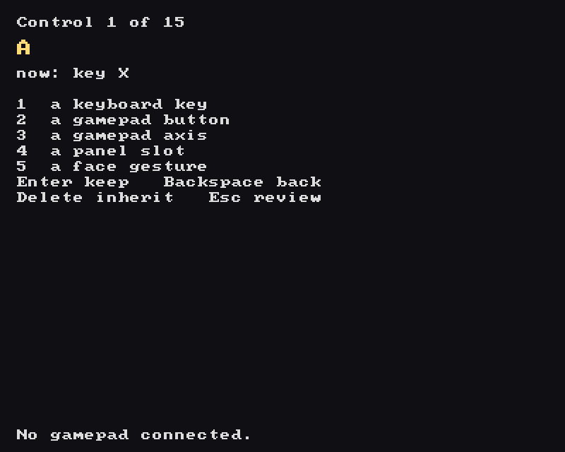

**A panel slot.** `4` draws the mouse panel from section 7 at half size. Click the slot you
want, or the game image. Slots already taken show the control that has them.

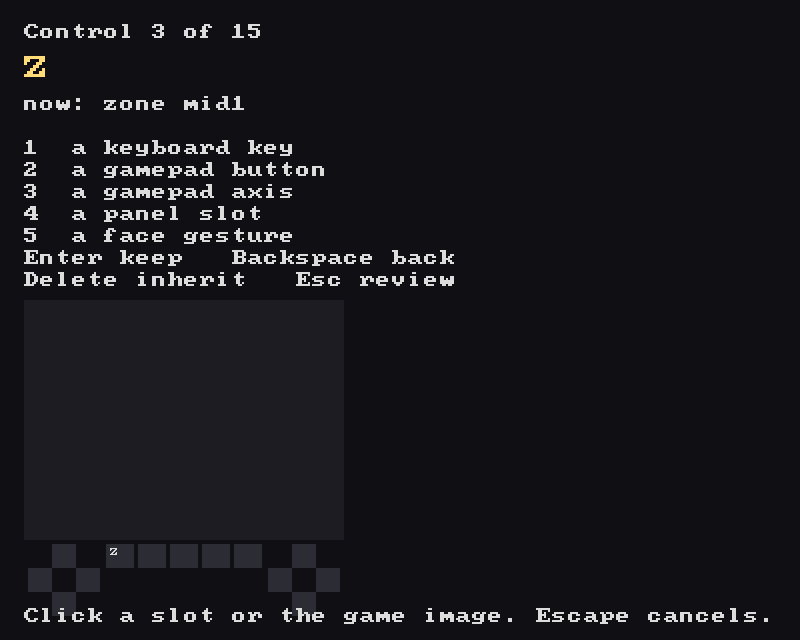

**A face gesture.** `5` lists the eleven gestures with their panel tags, and lights the
ones your face is doing right now, so it doubles as a way to see how the thresholds suit
you. Arrows and Enter pick a row; Space picks the one gesture that is firing, and says so
when none or several are. The camera starts the first time you open this list, never
before; `PJ64_FACE=0` keeps it off and the list still works, unlit. Frames are never
saved, shown or logged.

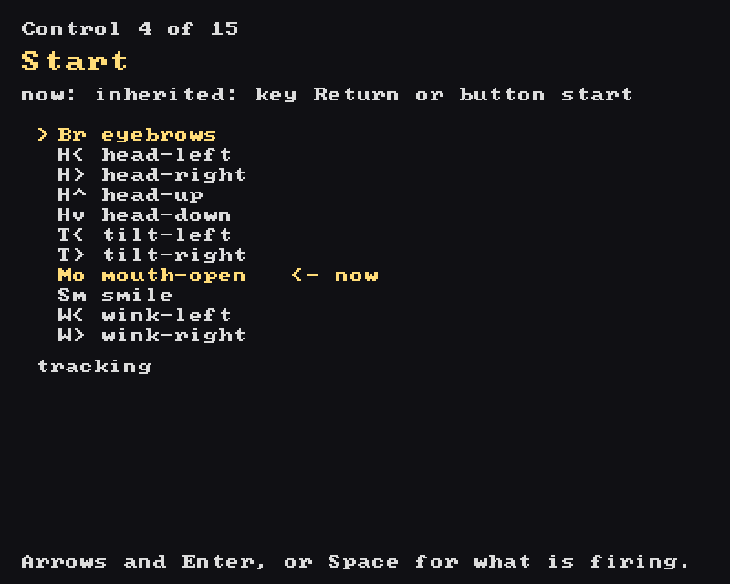

**The stick.** Press `1` to open its one mode, the six forms: either gamepad stick, the
mouse, your head in analog or digital, or four keys captured one after the other. Pushing a
gamepad stick picks it directly.

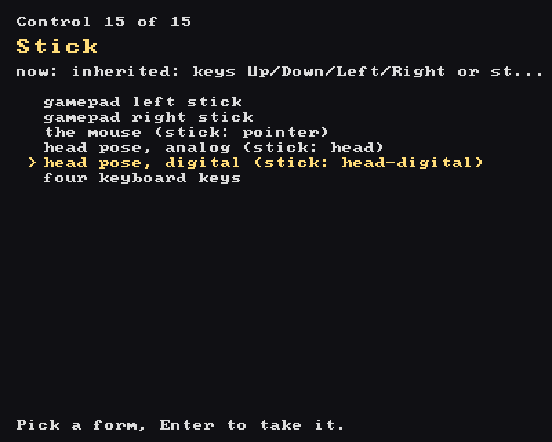

**Review.** All fifteen, the ones the file will contain lit and the inherited ones dim.
Two controls may share an input; the review says so and allows it. `S` goes on to save,
Backspace goes back to the last control.

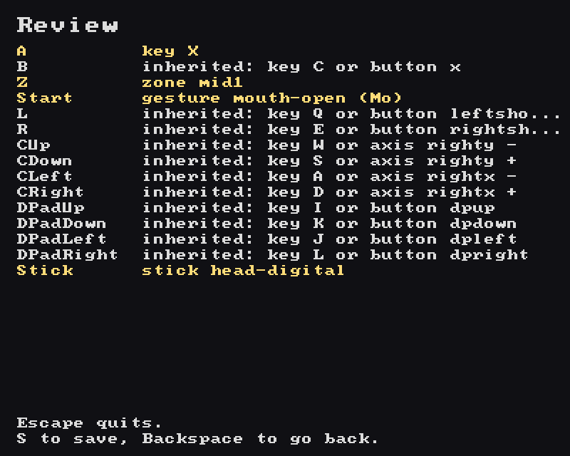

**Save.** Three destinations: `1` the default file, `Config/input.yaml` beside the
emulator; `2` beside a game, named after it, so it loads for that game alone (section 9);
`3` a path you type. For `2` and `3` you type a path and press Enter, and the screen shows
where the file will go; Enter again writes it.

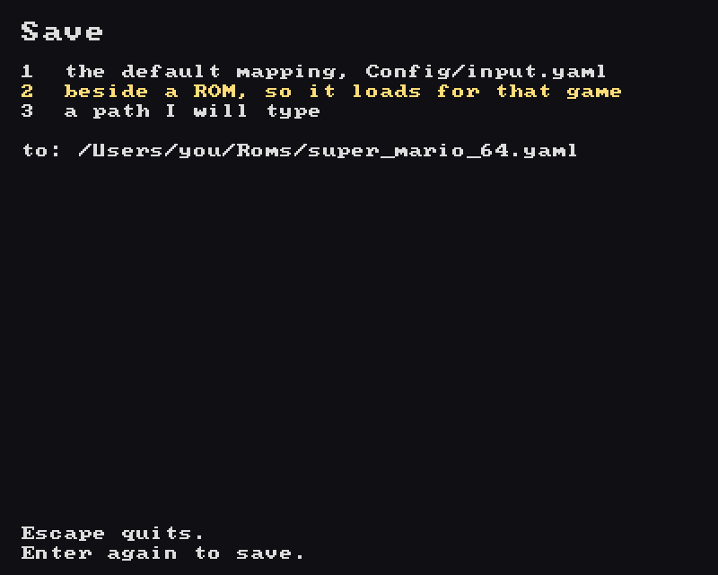

Two destinations get a warning and need a second Enter. A file with a mouse, face or head
binding aimed at `Config/input.yaml` would replace the keyboard table that grid mode
depends on. A file aimed at `Config/mouse/` or `Config/face/` lands in a folder every build
deletes and recopies. The warning names where the *shipped* layouts live; your own belongs
beside the ROM instead (destination `2`, section 9), not in either of those folders.

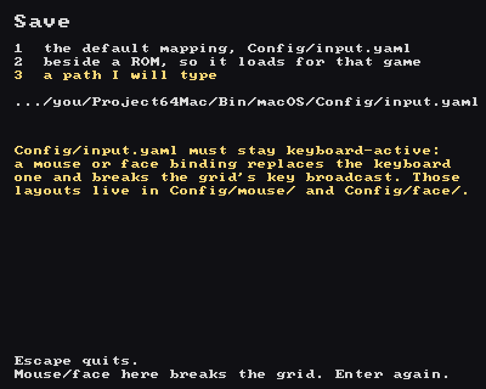

Nothing is written until the emulator's own reader has accepted it: the wizard emits the
file, loads it back through the same reader the game uses, and refuses with the reader's
reason if it objects. The message line reads "Saved. Escape to quit." when it is done.

## 7. Playing with a mouse

A layout can put every N64 button on a panel under the game and make the game image the
stick, so a one-button mouse plays on its own. Three ship under `Config/mouse/`, one each
for Super Mario 64, GoldenEye 007 and Mario Kart 64. They use the left button only and
never start the camera:

```sh
make run rom=Roms/super_mario_64.z64 input=Config/mouse/super_mario_64_usa.yaml
```

The window opens at 640x640: the game in the top 640x480, a panel in the 160 rows below.
It resizes like any game window (section 3) and the panel scales with the game; the pixel
distances below are at that starting size and grow with the window.

- **The game image is the stick.** Distance from its centre is the tilt, full at 160 px
  with a 16 px dead zone. Four faint diagonal lines split the image into direction
  quadrants, and the one your tilt points into lights up.
- **A click anywhere in the game image is one button** (A in the Mario layout). Whatever
  is under the cursor when you press stays pressed until you release, so "click A, then
  tilt" is a running jump.
- **The panel** is a D-pad cross on the left, a C cross on the right, and five slots
  between them. Hover and click; hold to hold.
- **Flicking down to a button never reads as a backward tilt.** A cursor that jumps more
  than 24 px between polls keeps the stick where it was until it lands. Fast aiming inside
  the game image lags a beat for the same reason. `PJ64_POINTER_FLICK=<px>` tunes that,
  `0` disables it.

`PJ64_OVERLAY=0` hides the guide over the game image (the quadrant lines, the ring and
the arrows); the panel always draws. The cursor is never captured.

In a layout file the forms are `{zone: <name>}` for a slot and `{stick: pointer}` for the
stick. The slots are `game`, `pad-up`, `pad-down`, `pad-left`, `pad-right`, `c-up`,
`c-down`, `c-left`, `c-right` and `mid1` to `mid5`; any control can take any slot, and two
controls on one slot are both pressed. A button can be a face gesture instead (next
section), so your own layout can mix the two.

### Toggle slots and the stick hold

One button can only press one slot at a time, and the stick lets go whenever the cursor
leaves the game image. Two forms get around both, and the shipped layouts use them:

- **A toggle slot**, `Z: {zone: mid2, toggle: true}`. One press turns Z on, the next turns
  it off, and in between the button is free: with Z on, a click in the game image is Z and
  A together. Any slot can be a toggle, the game image included (Mario Kart's accelerate).
  Every control on one slot must agree on `toggle`. Toggles clear when the game closes.
- **The stick hold**, `Stick: {stick: pointer, hold: mid5}`. The slot shows `Ho`. Press it
  and the stick goes back to the tilt the cursor last *rested* at in the game image, and
  keeps it while you reach for any other slot. It starts at the press, not before: on a
  slow reach down to `Ho` the stick reads the picture you cross, so the character may turn
  or slow on the way. It lets go on a second press, or once the cursor rests in the game
  image again, so you can click in the picture on the way back up and still have the held
  tilt.

"Rested" means staying within 8 px for 9 of the game's controller reads: about 150 ms in a
game that reads the controller 60 times a second, twice that in one that reads it 30
times, as Super Mario 64 and Mario Kart 64 do. A slow move down to the panel never rests,
so the hold never picks up the backward tilt the bottom of the picture reads as.
`PJ64_POINTER_SETTLE=<px>,<polls>` changes both numbers for a hand that moves more or
less; `0` turns resting off, and the hold then gives a centred stick and ends only on a
second press.

Toggle slots and the hold slot have a mark across their top-right corner, and are bright
while on. In Super Mario 64:

- **Dive:** run with the cursor, press `Ho`, press `B`.
- **Long jump:** run, press `Ho`, press `Z`, move up into the picture and click; press `Z`
  again to stand up.

### The menu

The panel's `==` slot opens a menu: `pad-down` in the three shipped layouts, which no
longer list `DPadDown` there, so it keeps its built-in keyboard key (`K`) and gamepad
D-pad down button — it is just off the panel now. A layout can put it anywhere with
`Menu: {zone: <slot>}`, or on a gesture with `Menu: {face: <gesture>}`. Opening it pauses
the game, and the panel shows the menu's items instead of the buttons:

| Slot | Item |
|---|---|
| `mid3`, the middle slot of the five, and `==` itself | `Go`: carry on playing |
| `mid1`, the first middle slot | `Fs`: full screen on or off |
| `mid2`, the second middle slot | `Fc`: recentre the face, while the camera runs |
| `mid4`, the fourth middle slot | `Sv`: save the game's state |
| `mid5`, the fifth middle slot | `Ld`: load the saved state |
| `pad-left`, the D-pad cross's left slot | `Rs`: reset the game |
| `c-right`, the C cross's right slot | `Qt`: quit |

`Sv`, `Ld`, `Rs` and `Qt` need two clicks: the first lights the slot, the second does it,
and a click anywhere else lets go. There is one save slot, so `Sv` replaces the last save.
The game gets no input while the menu is open. Each click that changes the menu lets the
game run for a single frame so the panel can redraw; the character stands still for it.
The click that closes the menu counts in the game only after you release it.

A layout's menu gesture, `Menu: {face: …}`, also closes the menu while it is open, like
`Go`.

`Sv` writes under `Bin/macOS/Save/`, in the folder named after the game and its checksum,
as the file ending `.pj.zip`; `Ld` reads it back. `make clean` removes `Bin/macOS`, and
the save with it.

A copy of a shipped layout made before the menu existed has no `==`, and that includes
one kept beside the ROM (section 9). Replace its `DPadDown: {zone: pad-down}` line with
`Menu: {zone: pad-down}` to get the menu.

## 8. Playing with your face

A layout can bind any button to a facial gesture and the stick to your head, so the
webcam is the whole controller. Two ship under `Config/face/`, always chosen by name:

```sh
make run rom=Roms/super_mario_64.z64 input=Config/face/super_mario_64_usa.yaml
make run rom=Roms/mk64.z64 input=Config/face/mario_kart_64_u.yaml
```

The camera starts by itself when a layout binds a gesture or the head stick; `face=1` or
`--face` forces it, `face=0` or `PJ64_FACE=0` keeps it off. macOS asks for camera
permission once, and because the emulator is not an app bundle the prompt is attributed to
the terminal or IDE you launched from. Frames stay in memory and are never saved, shown or
logged. If the camera is denied or absent, everything else keeps working; only the
gesture-bound controls go missing.

- **Your head is the stick.** `Stick: {stick: head}` turns a head turn into X and a nod
  into Y: full tilt at 15 degrees of turn or 10 of nod from your resting pose, with a dead
  zone at a fifth of that. `{stick: head-digital}` snaps the same motion to one of four
  full tilts. The resting pose is learned over a few seconds and holds while you are
  tilted, so sit still for a moment to recentre. `PJ64_FACE_STICK_YAW` and
  `PJ64_FACE_STICK_PITCH` set the full-tilt angles in radians.
- **Eleven gestures**, each `{face: <name>}` on any button: `eyebrows`, `head-left`,
  `head-right`, `head-up`, `head-down`, `tilt-left`, `tilt-right`, `mouth-open`, `smile`,
  `wink-left`, `wink-right`. Left and right are yours. A blink is not a wink. A file with a
  head stick cannot also bind the four `head-*` turns, since they are the stick.
- **The panel shows the tracker.** A dot under the middle slots is hollow while looking
  for a face, filled while tracking, crossed when the camera is unavailable. Beside it,
  each bound gesture shows as its tag and its button (`Mo=A`, `W<=C<`), lit while held.
  Tags: `Br` brows, `H<` `H>` `H^` `Hv` head, `T<` `T>` tilt, `Mo` mouth, `Sm` smile,
  `W<` `W>` winks.

Each measure has a threshold and an override: `PJ64_FACE_BROW` (0.035), `PJ64_FACE_YAW`
(0.25), `PJ64_FACE_PITCH` (0.20), `PJ64_FACE_ROLL` (0.25), `PJ64_FACE_MOUTH` (0.06),
`PJ64_FACE_SMILE` (0.05), `PJ64_FACE_EYE` (0.12); angles in radians, the rest in the face
detector's box units. `PJ64_FACE_DEBUG=1` prints all eight measures against their baselines
once a second, which is how to tune them to your face and camera.

## 9. A layout per game

Name a layout after the game and it loads without `input=`. The emulator looks for
`<rom>.yaml` beside `<rom>.z64` first, then `Config/mouse/<rom>.yaml` beside the binary,
which is why the shipped mouse layouts carry their game's file name. The first that exists
wins, an explicit `input=` beats both, and the emulator prints `input layout: <path>` on
stderr when it picks one. `Config/face/` is outside this lookup on purpose: a face layout
is always chosen by name.

Keep your own layouts beside the ROM. `make all` deletes and recopies `Config/mouse/` and
`Config/face/` under the binary on every build.

A copy of a shipped mouse layout made before the one-button change still binds face
gestures and starts the camera, and beside the ROM it wins over the new file in
`Config/mouse/`. Delete it, or copy the new one over it.

A matching layout that binds a gesture starts the camera. Anything that launches the
emulator unattended over a folder of games should set `PJ64_FACE=0`; the ROM sweep in
`Scripts/run_rom_pack.py` does.

## 10. When something goes wrong

**The camera never asks, and gestures do nothing.** A past denial for the terminal or IDE
you launch from makes the tracker report "denied" without a new prompt. System Settings >
Privacy & Security > Camera, find that app, switch it on.

**The window stays black.** Read a frame from inside the emulator, never a screen grab:

```sh
PJ64_FRAME_DUMP=/tmp/frame.ppm PJ64_FRAME_DUMP_AT=400 \
  perl -e 'alarm 20; exec @ARGV' -- ./Bin/macOS/Project64 Roms/game.z64 || true
```

That writes one 640x480 PPM from the back buffer. A healthy Super Mario 64 boot is about
89 percent non-black; below 80 something broke. `PJ64_TRACE=info` prints more, including
the viewport origin.

**"uCode crc not found in INI" on stderr, and no graphics.** The data files are not beside
the binary. `make all` copies them; a hand-rolled build that skipped `make config` did not.

**"input: … using built-in defaults" on stderr.** The mapping file was rejected whole. The
line names the file and the reason, and, where it can, the line number. Fix it, or let the
wizard write it.

**The game sits at the bottom of a tall window, and there is no panel.** The video plugin
is older than the emulator and ignores the lift the emulator asks for. Rebuild with
`make -j8 all`. `PJ64_VIEWPORT_OFFSET` is not the fix: the emulator sets or clears it on
every launch, whatever you set.

**A nod, tilt or wink reads backwards.** That is a sign fixed in the tracker's code, not in
your layout. Do not swap gesture names to compensate.

**The window won't resize.** stderr shows a line starting `window stays fixed-size: …`.
macOS refused to pin the picture's size, so the window stays at its starting size; the
game is unaffected. Grid tiles never resize (section 4).

## 11. Reference

Environment variables. Unset means the default.

| Variable | What it does |
|---|---|
| `PJ64_INPUT_YAML` | Path of the mapping file, overriding `Config/input.yaml` and any per-game layout. |
| `PJ64_FACE` | `0` never starts the camera; anything else starts it at launch; unset starts it when a layout needs it. |
| `PJ64_FACE_DEBUG` | Set to anything, even `0`, prints the eight face measures against their baselines once a second. |
| `PJ64_FACE_BROW`, `PJ64_FACE_YAW`, `PJ64_FACE_PITCH`, `PJ64_FACE_ROLL`, `PJ64_FACE_MOUTH`, `PJ64_FACE_SMILE`, `PJ64_FACE_EYE` | Gesture thresholds (section 8). |
| `PJ64_FACE_STICK_YAW`, `PJ64_FACE_STICK_PITCH` | Full-tilt angles of the head stick, in radians. |
| `PJ64_POINTER_FLICK` | Pixels per poll above which a cursor jump holds the stick; `0` disables. Default 24. |
| `PJ64_POINTER_SETTLE` | `<px>,<polls>`: how close, and for how many polls, the cursor must stay in the game image to count as resting, for the stick hold; `0` never rests. Default `8,9`. |
| `PJ64_OVERLAY` | `0` hides the guide over the game image: quadrant lines, ring and arrows. |
| `PJ64_TRACE` | Trace levels, a bare level for everything or `Module=level,…`, echoed to stderr. |
| `PJ64_FRAME_DUMP` | Path of a PPM to write one frame to. |
| `PJ64_FRAME_DUMP_AT` | Which frame to write. Default 300. |
| `PJ64_FRAME_DUMP_MIN_NONBLACK` | Wait for the first frame with at least this percent of non-black pixels instead. |
| `PJ64_FRAME_DUMP_MAX` | Latest frame to wait until; the best seen is written then. |
| `PJ64_VIEWPORT_OFFSET`, `PJ64_TILE_SIZE`, `PJ64_AUDIO_MUTE`, `PJ64_POINTER_FD`, `PJ64_GRID_KEYS_FD` | Set by the emulator for its own child processes and plugins. Never set by hand. |
| `PJ64_POINTER_INJECT`, `PJ64_FACE_INJECT`, `PJ64_POINTER_SELFTEST`, `PJ64_MENU_SELFTEST`, `PJ64_GRID_SELFTEST` | Test hooks used by the `*-selftest` targets. |

Make targets for players. `make help` also lists the self-tests; the build stages are
hidden.

| Target | What it does |
|---|---|
| `make -j8 all` | Build everything and install the data beside the binary. |
| `make test` | Smoke test: the version line and four `ok:` lines. |
| `make run rom=… [input=…] [face=0/1]` | Run one game. |
| `make grid roms="…"` | Run one to sixteen games side by side. |
| `make run-wizard` | Open the binding wizard. |
| `make wizard-screenshots` | Re-render the pictures in this guide. |
| `make unit-test` | Every headless test, including a check that those pictures are current. If only that check fails, right after a Homebrew SDL upgrade, the wizard itself still works fine — the committed pictures are just stale for a contributor to regenerate. |
| `make clean` | Remove the build and `Bin/macOS`, including your saves in `Bin/macOS/Save/` and your edited `Config/input.yaml`. |
