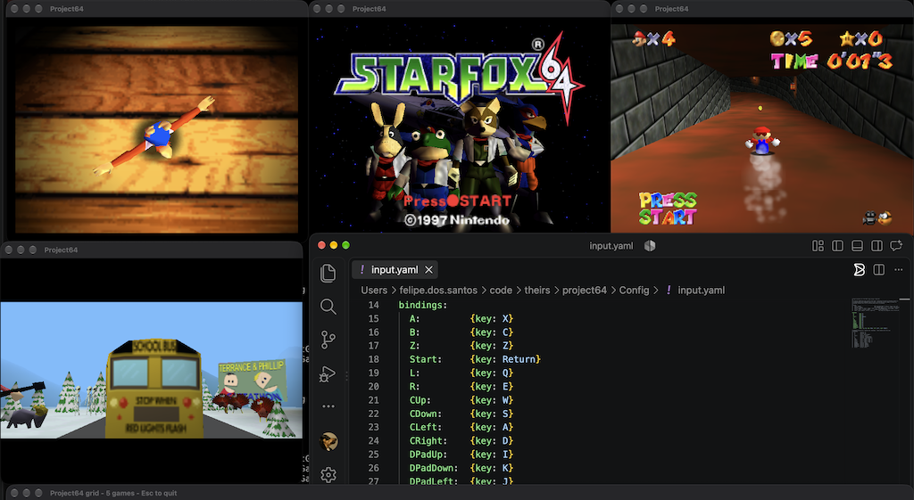

# Project64 for Apple Silicon

<p align="center">
  
</p>

A fork of [Project64](https://github.com/project64/project64), simplified down to a
single platform: it builds and runs only on macOS / arm64, using SDL3 for the window,
input and audio, and OpenGL for rendering. Everything that existed only for Windows,
Linux or Android has been removed, and this tree does not track upstream.

Built for educational purposes only — it exists to study how the emulator works on
Apple Silicon, not as a maintained release.

## Build

Prerequisites: Xcode command line tools plus Homebrew SDL3 and yaml-cpp
(`brew install sdl3 pkg-config yaml-cpp`).

```sh
make all                  # core, four plugins, frontend, and the ROM database beside the binary
make test                 # smoke test: version string and plugin exports
make input-config-test    # parser tests for the YAML input mapping
make pointer-layout-test  # geometry tests for the mouse panel and stick
make face-gesture-test    # classifier tests for the face gestures
make face-selftest rom=Roms/a.z64   # end-to-end face path, no camera
make game-config-test     # lookup tests for the per-game YAML
```

`make` with no target (same as `make help`) lists every target with its build stage.

## Game files

No game data ships with this repository and the build produces none — you supply your
own ROM files.

There is no ROM browser: the frontend takes ROM paths as arguments — one by default, or
several in grid mode. The convention is a `Roms/` folder at the repository root,
git-ignored so game files are never committed.

```sh
mkdir -p Roms
cp ~/Downloads/super_mario_64.z64 Roms/
make run rom=Roms/super_mario_64.z64
```

Any path works — `./Bin/macOS/Project64 /path/to/game.z64`. Use `.z64`, `.n64`, `.v64`
or a `.zip` containing one of them; 7-Zip archives are not supported.

## Grid mode

`make grid roms="Roms/a.z64 Roms/b.z64"` — or `./Bin/macOS/Project64 --grid a.z64 b.z64 …`
— opens 1–16 games side by side in a near-square grid and sends every keystroke to all of
them. A small always-on-top strip along the bottom owns the keyboard (the tiles never take
focus); Esc or closing the strip quits everything. Tiles render at the largest 4:3 size
that fits their cell and are muted. Each game is a separate process running the normal
single-ROM path, so one game cannot take down the others.

`make grid-selftest rom=Roms/a.z64` proves the broadcast by running one ROM in four tiles
and checking each read the strip's key state.

## Input mapping

Bindings are read once at startup from `Bin/macOS/Config/input.yaml`; a YAML named after
the ROM takes its place (see "Playing with a mouse"), and `PJ64_INPUT_YAML=/path` overrides
both. Each control takes exactly one input — `{key: X}`, `{button: a}`, `{axis: rightx, sign: -}`,
and for `Stick` also `{stick: left}` or `{keys: {up: Up, …}}` — so naming a control replaces
its built-in binding. The shipped file maps the **keyboard**; its commented block is the
full gamepad alternative. Delete the file, or leave a mistake in it, for the built-in
mapping — a bad file is ignored whole, with one line on stderr.

## Playing with a mouse

Thirteen panel slots plus a click in the game image cover all fourteen N64 buttons, so a
one-button mouse can play on its own; the shipped layouts move three buttons onto face
gestures anyway. Pick a layout under `Config/mouse/` and run with it:

```sh
make run rom=Roms/sm64.z64 input=Config/mouse/super_mario_64_usa.yaml          # camera starts
make run rom=Roms/sm64.z64 input=Config/mouse/super_mario_64_usa.yaml face=0   # mouse only
```

The window becomes 640x640 — the game unscaled in the top 640x480, a panel of buttons in
the 160 rows below.

- **The game image is the stick.** Distance from its centre is the tilt, full at 160 px
  with a 16 px dead zone. Four faint 45° lines split the image into direction quadrants,
  and the one your tilt points into lights up.
- **A click anywhere in the game image is one button** (A in the Mario layout). Whatever
  is under the cursor when you press stays pressed until you release, so "click A, then
  tilt" is a running jump.
- **The panel** is a D-pad cross on the left, a C cross on the right, and five slots
  between them. Hover and click; hold to hold.
- **Flicking down to a button never reads as a backward tilt.** A cursor that jumps more
  than 24 px between polls keeps the stick where it was until it lands. The same gate
  holds fast aiming inside the game image, too — a quick swing (as in GoldenEye) lags a
  beat until the cursor slows. `PJ64_POINTER_FLICK=<px>` tunes that; `0` disables it.

`PJ64_OVERLAY=0` hides the quadrant lines; the panel always draws.

When a layout binds a face gesture the webcam starts by itself (`face=1` or `--face`
forces it, `face=0` or `PJ64_FACE=0` keeps it off), adding three held buttons: raising
both eyebrows, turning your head left, and turning it right. macOS asks for camera
permission once, attributed to the terminal or IDE you launched from; a past denial is
fixed in System Settings > Privacy & Security > Camera. Frames stay in memory and are
never saved, shown, or logged. Everything else keeps working when the camera is denied or
absent — only the gesture-bound buttons go missing.

A dot in the panel, under the middle slots, shows the tracker: hollow while looking for a
face, filled while tracking, crossed when the camera is unavailable. The three gesture
labels beside it light up while held. `PJ64_FACE_DEBUG=1` prints the two measures once a
second, and `PJ64_FACE_BROW` / `PJ64_FACE_YAW` override the thresholds (defaults 0.035 and
0.25).

Layout files use two more binding forms, `{zone: <name>}` and
`{face: eyebrows|head-left|head-right}`, plus `{stick: pointer}` for `Stick`. The zones are
`game` (the game image), `pad-up`, `pad-down`, `pad-left`, `pad-right` (the left cross),
`c-up`, `c-down`, `c-left`, `c-right` (the right cross) and `mid1` to `mid5`; any control
can take any slot. Shipped: `super_mario_64_usa.yaml`, `goldeneye_007_u.yaml`,
`mario_kart_64_u.yaml`.

Name a layout after the ROM and it loads without `input=` — `Roms/sm64.yaml` beside
`Roms/sm64.z64`, or `Config/mouse/sm64.yaml` under the binary, which is why the shipped
layouts carry their ROM's base name. The first that exists wins, an explicit `input=`
beats both, and the frontend prints `input layout: <path>` when it picks one. Grid tiles
ignore per-game files. `make all` replaces the installed layouts on every build, so keep
your own beside the ROM rather than editing the shipped copy.

`make pointer-selftest rom=Roms/a.z64` proves the mouse path end to end, and
`make face-selftest rom=Roms/a.z64` the face path, the same way `make grid-selftest`
proves the grid's key broadcast. Neither opens the camera.

## Playing with your face

A layout can bind every button to a facial gesture and the stick to your head, so the
webcam is the whole controller. Two ship under `Config/face/`, chosen explicitly (they are
never picked up by ROM name):

```sh
make run rom=Roms/sm64.z64 input=Config/face/super_mario_64_usa.yaml
make run rom=Roms/mk64.z64 input=Config/face/mario_kart_64_u.yaml
```

The camera starts by itself for these layouts, with the same permission prompt and privacy
rules as above. Controls a layout leaves out keep their keyboard keys.

- **Your head is the stick.** `Stick: {stick: head}` turns yaw into X and pitch into Y:
  full tilt at 15° of turn or 10° of nod from your resting pose, with a dead zone at a fifth
  of that. `{stick: head-digital}` snaps the same motion to one of four full tilts. The
  resting pose is learned over a few seconds and holds while you are tilted, so sit still
  for a moment to recentre. `PJ64_FACE_STICK_YAW` and `PJ64_FACE_STICK_PITCH` set the
  full-tilt angles in radians.
- **Eleven gestures**, each `{face: <name>}` on any button: `eyebrows`, `head-left`,
  `head-right`, `head-up`, `head-down`, `tilt-left`, `tilt-right`, `mouth-open`, `smile`,
  `wink-left`, `wink-right`. Left and right are yours. A blink is not a wink. A file with a
  head stick cannot also bind the four `head-*` turns, since they are the stick.
- **The panel lists what is bound.** Beside the tracker dot, each bound gesture shows as
  its tag and its button (`Mo=A`, `W<=C<`), lit while held. Tags: `Br` brows, `H<` `H>`
  `H^` `Hv` head, `T<` `T>` tilt, `Mo` mouth, `Sm` smile, `W<` `W>` winks.

If a nod, tilt or wink reads backwards, that is a known sign question fixed in
`Source/Project64-sdl/FaceTracker.mm`, not something to fix in your layout.

Thresholds are per measure, each with an override: `PJ64_FACE_BROW` (0.035),
`PJ64_FACE_YAW` (0.25), `PJ64_FACE_PITCH` (0.20), `PJ64_FACE_ROLL` (0.25),
`PJ64_FACE_MOUTH` (0.06), `PJ64_FACE_SMILE` (0.05), `PJ64_FACE_EYE` (0.12); angles in
radians, the rest in Vision's face-box units. `PJ64_FACE_DEBUG=1` prints all eight measures
against their baselines once a second, which is how to tune them to your face and camera.

## What works

Super Mario 64 renders, plays audio and runs at full speed, with keyboard input through
SDL3; a gamepad works after swapping in the commented block in `Config/input.yaml`, a
one-button mouse with optional face gestures works with a layout from `Config/mouse/`,
and the face alone with one from `Config/face/` (see the two sections above). The window
is 640x480, or 640x640 with a mouse or face layout, and the mouse cursor is never captured.

Two limits worth knowing: the interpreter is the only CPU core, because Apple Silicon
refuses the writable-and-executable memory the dynamic recompiler needs; and there is
no settings UI, so configuration means editing `Bin/macOS/Config/Project64.cfg`.

## Diagnostics

With no UI, three environment variables are the way to see inside a running build:

- `PJ64_TRACE='Glide64=debug,AudioDriver=verbose'` raises trace levels for the named
  modules — or a bare level for all of them — and echoes to stderr.
- `PJ64_FRAME_DUMP=/tmp/frame.ppm`, with optional `PJ64_FRAME_DUMP_AT=400`, writes one
  frame from the back buffer as a binary PPM.
- `PJ64_FRAME_DUMP_MIN_NONBLACK=<percent>`, with optional `PJ64_FRAME_DUMP_MAX=<frame>`,
  makes the dump wait for the first frame whose non-black share clears the percentage
  instead of writing unconditionally at `PJ64_FRAME_DUMP_AT`.

## License

GPL-2.0, see [license.md](license.md). Working on this code with a coding agent?
[AGENTS.md](AGENTS.md) has the architecture notes and the traps.
